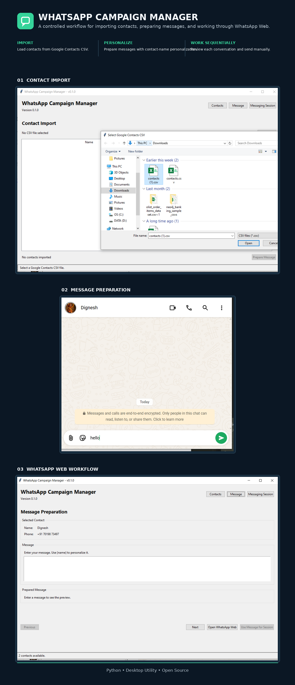

# 1. Project Poster

The project poster is stored at `screenshots/poster.png`.

# 2. Project Badges


# 3. Screenshots

| Screenshot | Description |
|---|---|
| `screenshots/import-screen-to-upload-google-contacts.PNG` | Google Contacts CSV import screen |
| `screenshots/message-in-draft-status.PNG` | Message preparation / draft status |
| `screenshots/message-post-screen.PNG` | Messaging workflow screen |
| `screenshots/poster.png` | Project poster |

# 4. Project Title

# WhatsApp Campaign Manager

# 5. Project Overview

WhatsApp Campaign Manager is a Windows desktop application for preparing and managing a controlled sequence of WhatsApp messages using contacts exported from Google Contacts.

The application imports a Google Contacts CSV file, displays valid contacts, prepares a personalized message using the `{name}` placeholder, and opens the appropriate WhatsApp Web conversation with the prepared message.

The application deliberately keeps the final **Send** action manual. It does not automate clicking the WhatsApp Web Send button.

### Purpose

- Simplify preparation of WhatsApp messages for a list of contacts.
- Support contact imports directly from Google Contacts CSV exports.
- Personalize a common message using contact names.
- Provide a controlled sequential messaging workflow.

### Problem Solved

Manually preparing the same message for multiple contacts can be repetitive and error-prone. This application centralizes contact import, message preparation, personalization, and contact sequencing while leaving the final message-send action under user control.

### Typical Use Cases

- Preparing personalized messages for a contact list.
- Working through a list of contacts sequentially.
- Using a Google Contacts CSV export as the source contact list.
- Preparing WhatsApp Web conversations without automating the final Send action.

# 6. Features

- Import contacts from a Google Contacts CSV export.
- Validate the presence of the required Google Contacts CSV columns.
- Assemble contact names from First Name, Middle Name, and Last Name.
- Read the primary phone number from `Phone 1 - Value`.
- Skip rows with missing contact names or phone numbers.
- Display imported contacts in the application.
- Prepare a reusable message template.
- Personalize messages using the `{name}` placeholder.
- Preview the personalized message for the current contact.
- Open the appropriate WhatsApp Web conversation.
- Process contacts sequentially.
- Mark contacts as sent.
- Skip contacts when required.
- Navigate between previous and next contacts.
- Display session progress including completed, skipped, and remaining contacts.
- Record application activity in `logs/application.log`.
- Generate an execution report in `logs/execution_report.txt`.

### Messaging Safety Boundary

The application does **not**:

- Automatically click the WhatsApp Web Send button.
- Automate message sending through Selenium or Playwright.
- Use the WhatsApp Business API.
- Perform browser automation for the final Send action.

The user reviews the prepared message and manually clicks **Send** in WhatsApp Web.

# 7. Technology Stack

| Technology | Usage |
|---|---|
| Python 3.14 | Application development |
| Tkinter / ttk | Desktop graphical user interface |
| Python `csv` | Google Contacts CSV import |
| Python `dataclasses` | Contact, message, and session models |
| Python `pathlib` | File and directory handling |
| Python `urllib.parse` | WhatsApp Web message URL encoding |
| Python `webbrowser` | Opening WhatsApp Web |
| PyInstaller | Executable packaging |
| Git | Source control |
| GitHub | Repository hosting and release management |

# 8. Project Structure

```text
026 - WhatsApp Campaign Manager/
│
├── .github/
├── .gitignore
├── .vscode/
├── LICENSE
├── main.py
├── pyproject.toml
├── README.md
├── requirements.txt
│
├── assets/
│   ├── fonts/
│   ├── icons/
│   ├── images/
│   └── templates/
│
├── data/
│   ├── input/
│   ├── output/
│   └── samples/
│
├── docs/
│   └── UserGuide.md
│
├── logs/
│   ├── application.log
│   └── execution_report.txt
│
├── releases/
│   ├── latest/
│   ├── v1.0/
│   └── v1.1/
│
├── screenshots/
│   ├── import-screen-to-upload-google-contacts.PNG
│   ├── message-in-draft-status.PNG
│   ├── message-post-screen.PNG
│   └── poster.png
│
├── src/
│   ├── config.py
│   │
│   ├── core/
│   │
│   ├── models/
│   │   ├── contact_model.py
│   │   ├── message_model.py
│   │   └── messaging_session_model.py
│   │
│   ├── services/
│   │   ├── csv_service.py
│   │   ├── logging_service.py
│   │   ├── messaging_session_service.py
│   │   └── whatsapp_service.py
│   │
│   ├── ui/
│   │   ├── csv_import_panel.py
│   │   ├── main_window.py
│   │   ├── message_panel.py
│   │   └── messaging_session_panel.py
│   │
│   └── utils/
│
└── tests/
```

# 9. Module Overview

| **Module** | **Responsibility** |
|---|---|
| **UI** | Provides the Tkinter/ttk desktop interface and coordinates user interaction. |
| **Services** | Handles CSV importing, WhatsApp Web integration, messaging-session control, logging, and execution reporting. |
| **Models** | Defines the application's contact, message, and messaging-session data models. |
| **Configuration** | Defines application settings, paths, constants, and required directory initialization. |
| **Core** | Reserved for application business-logic modules; no current Python source modules are implemented here. |
| **Utilities** | Reserved for reusable helper modules; no current Python source modules are implemented here. |

# 10. Source Code Overview

| **Source File** | **Purpose** | **Dependencies** |
|---|---|---|
| `main.py` | Application entry point. Initializes directories and logging, creates the main Tkinter window, and starts the application event loop. | Tkinter, project configuration, logging service, main window |
| `src/config.py` | Centralizes application constants, directory paths, CSV column definitions, UI dimensions, and directory initialization. | `pathlib` |
| `src/models/contact_model.py` | Defines the `Contact` data model used to represent an imported contact. | `dataclasses` |
| `src/models/message_model.py` | Defines the message template model and performs `{name}` personalization. | `dataclasses` |
| `src/models/messaging_session_model.py` | Defines session state including current contact position, completed contacts, skipped contacts, and progress counts. | `dataclasses` |
| `src/services/csv_service.py` | Imports and validates Google Contacts CSV data and converts valid rows into `Contact` objects. | `csv`, `dataclasses`, `pathlib`, project contact model/configuration |
| `src/services/logging_service.py` | Writes application activity, checkpoints, errors, and execution reports. | `datetime`, `pathlib`, project configuration |
| `src/services/messaging_session_service.py` | Controls sequential contact processing, including marking contacts sent, skipping contacts, and navigation. | Project contact and session models |
| `src/services/whatsapp_service.py` | Builds personalized WhatsApp Web URLs and opens the selected conversation in the user's browser. | `webbrowser`, `urllib.parse`, project message model |
| `src/ui/csv_import_panel.py` | Provides CSV selection, contact import, contact display, import summary, and transition into message preparation. | Tkinter/ttk, project CSV service and contact model |
| `src/ui/message_panel.py` | Provides message entry, personalization preview, contact navigation, WhatsApp Web preparation, and message-session handoff. | Tkinter/ttk, project message and WhatsApp services |
| `src/ui/messaging_session_panel.py` | Provides the sequential messaging-session interface, including current-contact display, prepared-message preview, WhatsApp Web launch, sent/skip actions, navigation, and progress. | Tkinter/ttk, project contact/message/session/WhatsApp services |
| `src/ui/main_window.py` | Provides the main application window and coordinates navigation between contact import, message preparation, and messaging-session panels. | Tkinter/ttk, project configuration, models, and UI panels |

# 11. How to Run

## Prerequisites

- Windows 10
- Python 3.14
- Git
- WhatsApp account accessible through WhatsApp Web
- Google Contacts CSV export

## Run from Source

Open PowerShell in the project root:

```powershell
cd "D:\ADGProjects\026 - WhatsApp Campaign Manager"
```

Run the application:

```powershell
python main.py
```

## Basic Workflow

1. Launch the application.
2. Select a Google Contacts CSV export.
3. Review the imported contacts.
4. Prepare a message.
5. Use `{name}` where contact-name personalization is required.
6. Open the Messaging Session.
7. Select **Open WhatsApp Web** for the current contact.
8. Review the prepared message in WhatsApp Web.
9. Manually click **Send** in WhatsApp Web.
10. Return to the application and select **Mark Sent & Next**.
11. Use **Skip & Next** when a contact should not be processed.
12. Continue until the session is complete.

# 12. How to Build

The project can be packaged as a Windows executable using PyInstaller.

From the project root:

```powershell
pyinstaller --noconfirm --clean --onefile --windowed --name "WhatsAppCampaignManager" main.py
```

The generated executable will be placed in:

```text
dist/
└── WhatsAppCampaignManager.exe
```

# 13. Version

| Item | Value |
|---|---|
| **Current Version** | 0.1.0 |
| **Release Date** | 25 September 2026 |
| **Status** | Complete / MVP |

# 14. Development Workflow

```text
Requirements
    ↓
Architecture & Design
    ↓
Slice Planning
    ↓
Implementation
    ↓
Slice Verification / ESAT
    ↓
Functional Testing
    ↓
README & Documentation
    ↓
Executable Build
    ↓
Git Commit
    ↓
Git Tag
    ↓
GitHub Push
    ↓
GitHub Release
```

Development was organized into implementation slices so that each functional increment could be run and verified before proceeding to the next stage.

The application was implemented as a standard Windows desktop project without a cloud deployment dependency.

# 15. License

This project is licensed under the **MIT License**.

See [`LICENSE`](LICENSE) for the complete license text.
